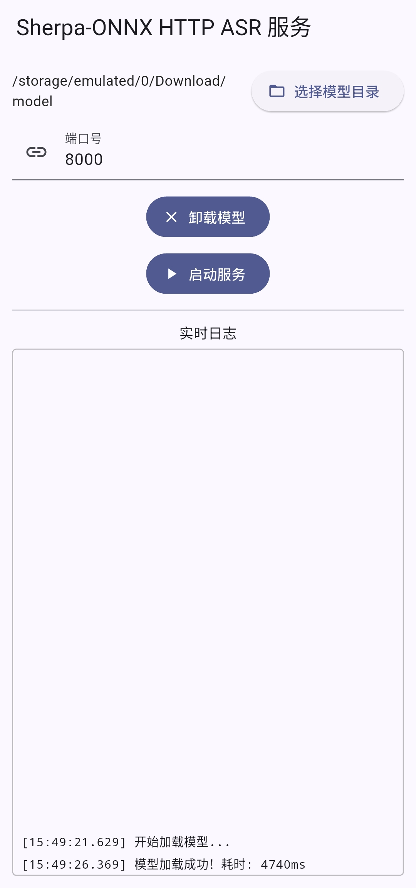

# ASR Maid

A local speech recognition server application built with [sherpa-onnx](https://github.com/k2-fsa/sherpa-onnx) and [SenseVoice](https://github.com/FunAudioLLM/SenseVoice), implemented using Flutter.



## 🧠 Project Overview

This project provides a local speech recognition service implemented in Flutter, supporting both Android and Windows platforms. Microphone and storage permissions will be requested upon the first model load — please allow all. The loading process may cause a brief delay, so please be patient.

### ✅ Advantages

- High recognition accuracy and fast response powered by SenseVoice
- Multi-language support
- Fully local deployment

### ⚠️ Disadvantages

- AI-developed, not actively maintained
- Bugs and power consumption are unknown

---

## ⏱️ Performance

### Model Loading Time (int8 model)

| Device            | Time Taken |
|-------------------|------------|
| ZUK Z2            | 17.5 sec   |
| Redmi Note10 Pro  | 5.2 sec    |

### Local Speech Recognition Time (per sentence)

| Device            | Time Taken |
|-------------------|------------|
| Snapdragon 820    | 0.6 sec    |
| Dimensity 1100    | 0.3 sec    |
| i7-12700H         | < 0.1 sec  |

---

## 📦 Model Download & Usage

- Download link: [Click to download model](https://github.com/k2-fsa/sherpa-onnx/releases/download/asr-models/sherpa-onnx-sense-voice-zh-en-ja-ko-yue-2024-07-17.tar.bz2)
- Extract to any location

> The default model is `model.int8.onnx`. To use a larger model, rename it to the same filename.

### Memory Usage

- int8 model: ~650MB
- Large model: Not tested, estimated ~2GB

---

## 📱 Usage Recommendations

- Mobile device microphones yield better recording quality and recognition accuracy
- Can be compiled as a Windows executable
- IPv6 or public network access is untested — please verify if needed

---

## 📲 Optional Android Voice Input Method

- [voxime-sensevox](https://github.com/dapanggougou/voxime)
- Long press to record, release to transcribe

---

## 📡 API Example

```bash
curl -X POST http://192.168.1.110:8000/asr \
  --header "Content-Type: audio/wav" \
  --data-binary "@zh.wav"
```

### Example Response:

```json
{
  "status": "success",
  "result": "Open hours are from 9 AM to 5 PM.",
  "processing_time_ms": 2502,
  "recognition_time_ms": 2221
}
```

---

## 🙏 Acknowledgements

- [FunASR SenseVoice](https://github.com/FunAudioLLM/SenseVoice)
- [sherpa-onnx](https://github.com/k2-fsa/sherpa-onnx)
- AI contributors:
  - Claude 4 Sonnet (major contribution)
  - OpenAI o3, Gemini 2.5 Pro